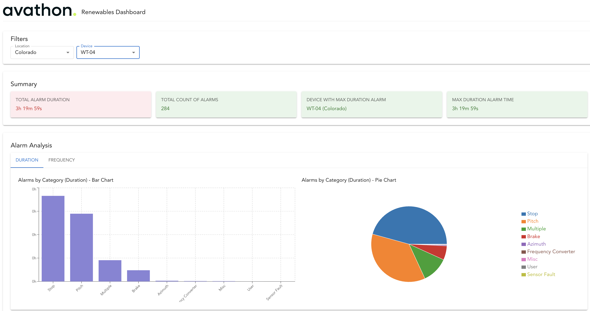

# Avathon Dashboard

A React-based dashboard application for monitoring and analyzing renewable energy data from wind farms. This application provides visualization and analysis of turbine data and fault events across Minneapolis and Colorado wind farms.



## Key Features

- **Wind Farm Selection**: Toggle between Minneapolis and Colorado wind farms
- **Advanced Filtering**:
  - Location (Wind Farm) - Filter alarms by wind farm location
  - Device (Turbine) - Filter alarms by specific turbine (dependent on location)
  - Time Range - Filter alarms by time period (24h, 7d, 30d)
  - Fault Category - Filter alarms by fault category
  - Alarm Code - Filter alarms by specific alarm code
- **Summary Tiles**:
  - Total Alarm Duration
  - Total Count of Alarms
  - Device with Maximum Duration Alarm
  - Maximum Duration Alarm Time
- **Data Visualization**:
  - Bar Charts:
    - Top Alarms by Duration
    - Top Alarms by Frequency
  - Pie Charts:
    - Alarms by Category (Duration)
    - Alarms by Category (Frequency)
- **Interactive Data Table**:
  - Sortable columns (Start Time, Resolution Time, Category, Alarm Code)
  - Global search functionality
  - Pagination
  - Tooltips for long descriptions

## Tech Stack

- **Frontend Framework**: React 18
- **Language**: TypeScript
- **UI Library**: Material-UI (MUI) v5
- **Charting Libraries**: 
  - Recharts
- **Build Tool**: Vite
- **Code Quality**: ESLint

## Project Structure

```
src/
├── components/
│   ├── dashboard/     # Main dashboard layout
│   ├── filters/       # Wind farm and device filters
│   ├── tiles/         # Summary statistics tiles
│   ├── charts/        # Recharts visualizations
│   ├── table/         # Interactive data table
│   ├── tabs/          # Tab components
│   └── layout/        # Layout components
├── context/           # React context for state management
└── types/            # TypeScript type definitions
```

## Critical Files and Their Roles

### 1. State Management
- **`src/context/AppContext.tsx`**
  - Centralized state management using React Context
  - Manages alarms, devices, and filter states
  - Handles data loading and error states
  - Provides global state access to all components

### 2. Data Processing and Display
- **`src/components/table/DataTable.tsx`**
  - Implements data filtering and sorting
  - Handles pagination and search functionality
  - Manages table state and interactions
  - Optimizes performance with memoization

### 3. Data Visualization
- **`src/components/charts/Charts.tsx`**
  - Implements data visualization using Recharts
  - Handles chart data processing and filtering
  - Manages chart state and interactions
  - Provides multiple chart views (Bar, Pie)

### 4. Summary Statistics
- **`src/components/tiles/Tiles.tsx`**
  - Displays key metrics and statistics
  - Implements data aggregation
  - Shows real-time statistics
  - Updates dynamically with filters

### 5. User Controls
- **`src/components/filters/Filters.tsx`**
  - Manages filter controls and user interactions
  - Updates global filter state
  - Provides location and device selection
  - Handles filter dependencies

### 6. Type Definitions
- **`src/types/data.ts`**
  - Defines TypeScript interfaces and types
  - Ensures type safety across the application
  - Documents data models
  - Guides component development

### 7. Main Layout
- **`src/components/dashboard/Dashboard.tsx`**
  - Manages overall application layout
  - Handles loading and error states
  - Coordinates component placement
  - Provides responsive design

## Data Flow and Processing

### 1. Data Loading
- Initial data loaded from JSON files
- Stored in AppContext
- Available globally to all components

### 2. Filtering Pipeline
```
Raw Data → Device Lookup → Location Filter → Device Filter → 
Time Filter → Fault Type Filter → Alarm Code Filter → 
Text Search → Sorting → Pagination
```

### 3. Performance Optimizations
- Memoization of computed values
- Efficient device lookup using Map
- Optimized re-renders using React.memo
- Paginated data table for large datasets

### 4. Error Handling
- Input validation
- Null checks for device lookups
- Date parsing error handling
- Type safety with TypeScript

## Getting Started

### Prerequisites

- Node.js (v16 or higher)
- npm or yarn

### Installation

1. Clone the repository:
```bash
git clone https://github.com/aakashcal/renewables-dashboard.git
cd renewables-dashboard
```

2. Install dependencies:
```bash
npm install
```

3. Start the development server:
```bash
npm run dev
```

## Deployment

The application is deployed using Firebase Hosting. To deploy:

1. Install Firebase CLI:
```bash
npm install -g firebase-tools
```

2. Login to Firebase:
```bash
firebase login
```

3. Initialize Firebase in the project:
```bash
firebase init
```

4. Deploy the application:
```bash
firebase deploy
```

## Contributing

1. Fork the repository
2. Create your feature branch (`git checkout -b feature/amazing-feature`)
3. Commit your changes (`git commit -m 'Add some amazing feature'`)
4. Push to the branch (`git push origin feature/amazing-feature`)
5. Open a Pull Request

## License

This project is licensed under the MIT License - see the [LICENSE](LICENSE) file for details.

## Acknowledgments

- Material-UI for the component library
- Recharts for data visualization
- Vite for the build tool
